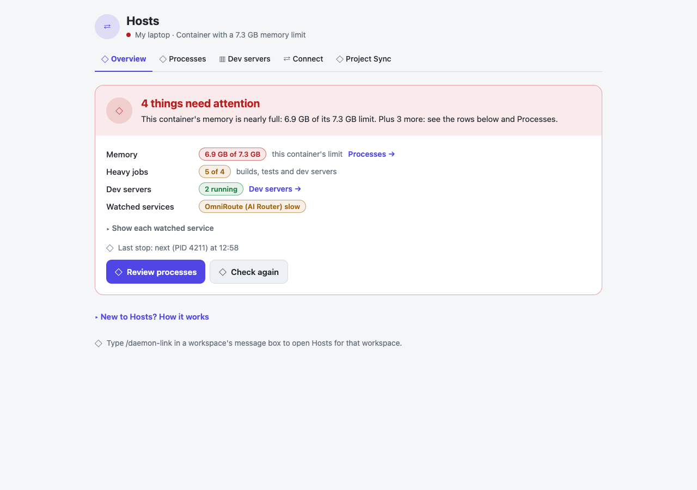
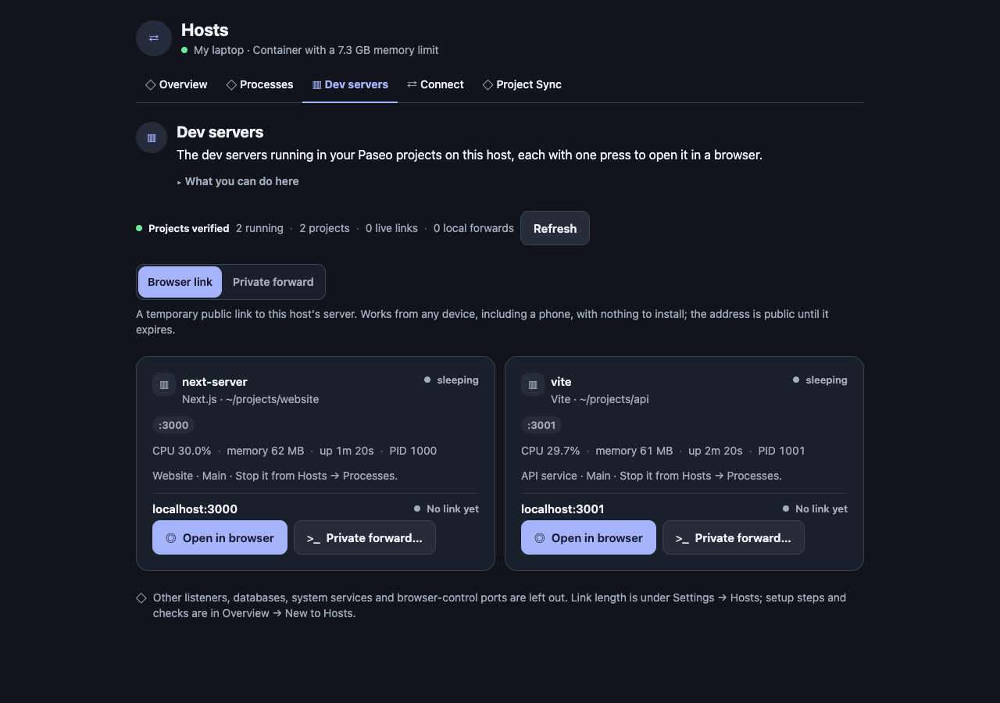
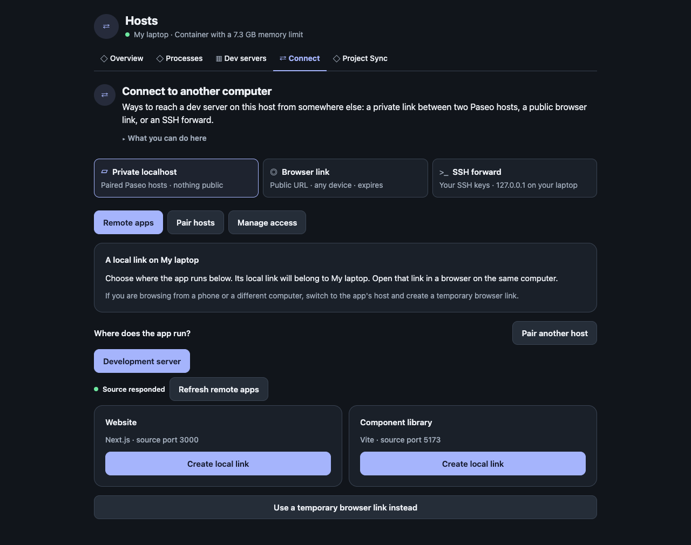
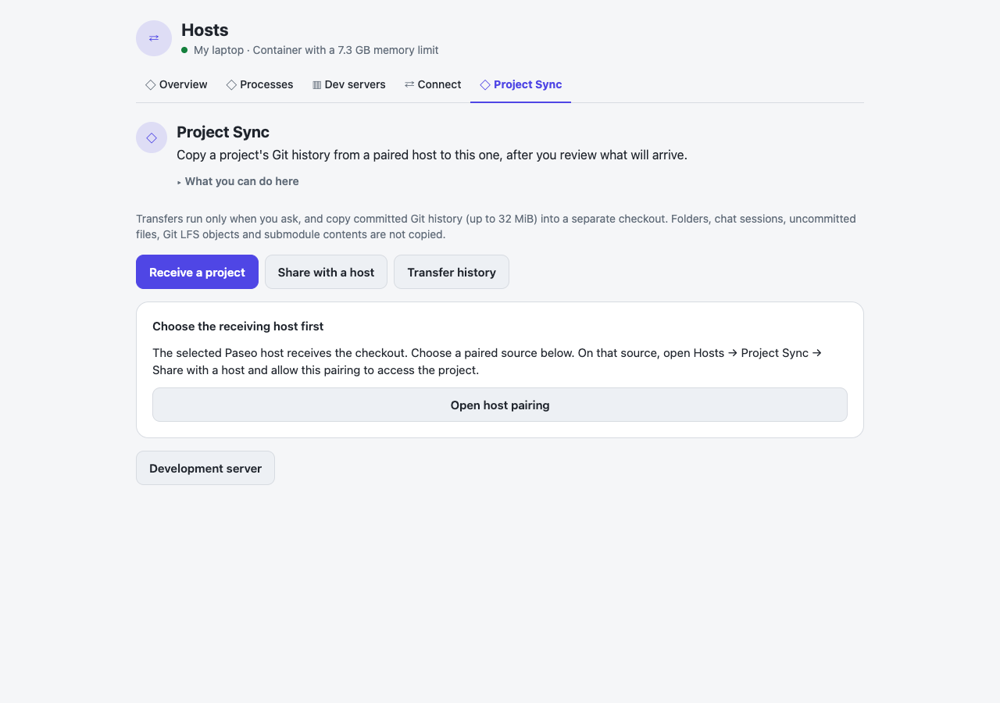
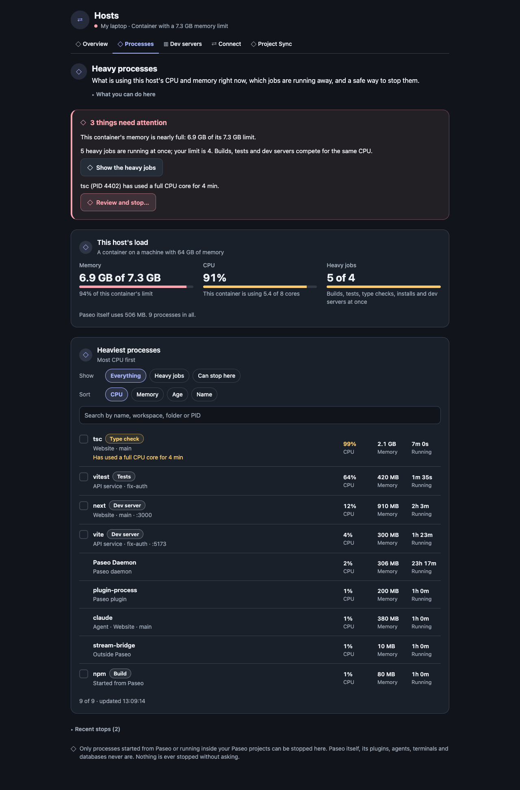
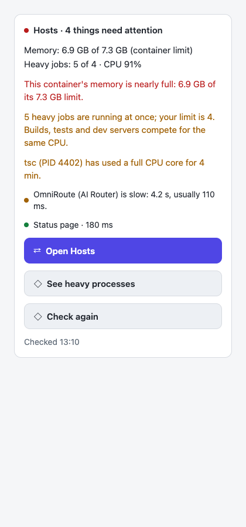

# Daemon Link for Paseo

**Keep a Paseo host healthy, and open its dev servers in one press.**

See what is using a host's CPU and memory, against the container's own limit, and stop a runaway
build safely after a list of exactly what will stop. Watch services on other machines, such as
OmniRoute. See every dev server running on a host, press **Open**, and it appears in your browser.
Pair two Paseo hosts for a private local URL, or save an SSH forward. Receive selected Git projects
with a preview and history.

Supports Paseo 0.7 through 0.11 (current releases need 0.8 or newer; see
[Paseo compatibility](#paseo-compatibility)).

The plugin is **Daemon Link**; its sidebar entry is **Hosts**, matching Paseo's host terminology.

[Install](#install) · [One-press Open](#open-a-dev-server-in-one-press) ·
[Private connection](#your-first-private-connection) · [Screenshots](#inside-the-plugin) ·
[Troubleshooting](#troubleshooting) · [Contributing](#development-and-contributing)



*Actual plugin components rendered with fictional data. Every screenshot in this repository uses
an isolated preview: no real accounts, host addresses, project names, credentials, or conversations.*

## What you get

- **Heavy processes, first-class.** The Processes tab lists the heaviest processes with how long
  they have run and which workspace or dev server they belong to, groups each build or test run with
  everything it started, and flags runaways: a process holding a full CPU core for minutes, memory
  near the container's limit, or more heavy jobs at once than your limit (4 by default).
- **Memory against the real limit.** Inside a container, Daemon Link reads the container's own
  memory limit (cgroups), so "6.9 GB of 7.3 GB" is judged against what actually stops processes,
  not the 64 GB machine. On macOS it uses the whole machine.
- **A safe stop.** Select processes, see exactly what will stop (children included) and what won't,
  then stop: each is asked to exit, and anything still running after 10 seconds is stopped
  forcefully. Paseo itself, its plugins, agents, terminals and databases are never stopped, and
  every stop is logged.
- **Watched services.** Add health URLs on other machines (such as the AI Router's OmniRoute, offered
  in one press when that plugin is set up). A slow or failing answer shows on the sidebar dot and the
  Overview card in plain words: "OmniRoute is slow: 4.2 s, usually 110 ms".
- **Native on Paseo 0.11.** A full Hosts screen with its own sidebar row and a status dot that opens
  a quick health check. Older apps keep the 0.9 sidebar surface.
- **One press to open.** Every verified dev server on the host is a card with an **Open** button, in
  the Hosts sidebar and in each workspace's Hosts tab. Open starts a browser link (or reuses the live
  one) and lands your browser on the app; the card shows starting, ready with time left, or why not.
- **Links that last a work session.** Browser links default to 2 hours (15 minutes to 8 hours in
  Settings), show their remaining time, and **Extend** in place without a new URL, up to 24 hours.
- **Private routes, side by side.** Pair hosts once for a private localhost link, or save an SSH
  forward preset to the server's port; nothing is published. The surface says when each is right.
- **Reviewed project transfers.** Separate sharing permissions, a commit preview, isolated checkouts,
  and persistent transfer history. Nothing syncs automatically.
- **Automatic health checks.** The daemon re-checks hosts on a schedule and flags a dev server that
  stopped serving, a failed browser link, an SSH forward that is down, a runaway, memory near the
  limit, too many heavy jobs, or a slow watched service, per workspace.
- **What this workspace costs.** The workspace tab sums the CPU and memory of the workspace's own
  processes and shows each as a share of the host, so you can tell a loaded machine from a loaded
  workspace.
- **A chip only when a chat needs you.** Under an agent's message box, a chip appears only when that
  workspace's dev server stopped, a link to it failed, or one of its jobs drives the host's load. It
  opens the Hosts tab for that workspace. A calm chat shows nothing; host-wide health is the sidebar
  dot's job.
- **Guidance where you need it.** Four tabs, technical parts folded into rows you open in place, and
  a Help tab of plain questions with live setup checks on Overview.

Agent Browser is not required. Daemon Link forwards traffic; your normal browser renders the app. The
app cannot be rendered inside Paseo itself: the plugin SDK has no WebView and no plugin HTTP route,
so a browser link, a paired-host forward, or an SSH forward is always the mechanism. Daemon Link's
job is to make that one press.

## Install

Add `itsjustanks/paseo-plugin-daemon` in **Paseo → Settings → Plugins**, or use the CLI:

```sh
paseo plugin add itsjustanks/paseo-plugin-daemon
paseo plugin ls
```

Enable plugins if needed, confirm **daemon-link** is `running`, and open **Hosts** from the
sidebar. Paseo installs dependencies in its managed checkout; no manual build or daemon restart
is needed. The plugin also provides a workspace panel and a Command Center entry.

Plugins run as trusted code with your daemon's privileges. Install from a source you trust.
For private localhost access, install this plugin on **both** computers running Paseo.
A browser-only device can use a temporary browser link instead.

Update a Git-managed installation with:

```sh
paseo plugin update daemon-link
```

## Open a dev server in one press

With the remote host selected, open **Hosts → Dev servers** (or the **Hosts** tab of the workspace
the server runs in) and press **Open in browser** on its card. Daemon Link reserves a browser tab,
starts a temporary HTTPS link to that port (or reuses the live one), and sends the tab there once the
link is connected. The card reads **Starting link**, then **Link ready · 2 h left**, or **Link
failed** with the reason. Press **Extend** to renew a live link without a new URL, or **Close link**
when you are done. The dev server itself is never touched.

A browser link is a public URL protected by a private session cookie and by the service lease, and it
always expires. If you would rather publish nothing, switch the card row to **Private forward**: it
shows the same servers with an **SSH forward…** button that presets the remote port, and a
**Paired-host link…** button for the private relay described next.

## Your first private connection

Imagine a development server running Paseo and a laptop also running Paseo. The server hosts the
app; the laptop receives a local port. You can manage either through Paseo's host picker.

```text
Development server                         Your laptop
Paseo + Daemon Link                         Paseo + Daemon Link
Project app on port 3000  <── encrypted ──  Local forward on port 3000
                             relay                   ↑
                                           Browser: localhost:3000
```

### 1. Start a project app

On the development server, open a project in Paseo, then start its normal dev command in that
project's terminal. For example:

```sh
npm run dev
```

Keep that terminal running. Open **Hosts → Dev servers** with the server selected.
Recognized apps appear automatically with their project, framework, and listening port.
The plugin discovers an existing server; opening the panel does not start your project for you.

### 2. Pair the two hosts

On the development server, open **Hosts → Dev servers → Open privately on your own computer → Pair
hosts → Create pairing code**.
Use Paseo's host picker to select your **laptop's daemon**, then paste the code under **Pair host**.

Pairing establishes permission for one host to discover and access the other's eligible project
apps. It does not grant agent, file, process-control, or daemon-management access. Pair separately
in the other direction if both computers will host apps.

### 3. Open the remote app

Keep your laptop selected. Choose the paired development server and press **Create local link**
beside its app. **Copy local URL** and open it on your laptop, or use **Open in this browser**
when this browser runs on that same computer. If the preferred local port is occupied, Daemon Link
chooses a free one instead.

**A local port belongs to the selected daemon's computer.** Selecting the remote daemon does not
create a port on your laptop. The host label and in-app guide explain this throughout the flow.

### 4. Finish or reconnect

**Close forward** removes local access while leaving the project server running. **Revoke access**
on the hosting daemon removes a peer's permission and closes its active connections.

Pairings persist. Active forwards close when the plugin stops; use **Create local link** to recreate
them. After a plugin or daemon restart, open Hosts on the hosting daemon once to initialize
project access. Both plugins must remain running while you use a connection.

## Inside the plugin

| Tab | What to do here |
| --- | --- |
| **Overview** | The host's state in words and two buttons; watched services, setup checks and details fold out. |
| **Processes** | Heaviest processes, runaways, memory against the limit, the ask-first stop; recent stops fold out. |
| **Dev servers** | A card per app with Open; browser links, private links, SSH forwards and Project Sync fold out. |
| **Help** | Plain questions, each folded, and how Hosts works. |

Version 0.11.0 follows the design standard's update of 2026-10-06 (the layout of paseo-mcp 0.19):
four tabs, no tab intros, and the technical or less-used parts in fold-out rows. 0.10's **Connect**
and **Project Sync** tabs now fold out under **Dev servers**, and links to them still land there.
"What you can do here" and the troubleshooting list became Help's questions. Nothing was removed.

Each workspace also gets a **Hosts** tab, in the workspace view and in the Projects explorer; what it
shows depends on the panel scope setting described below.

### Hosts workspace tab: only what belongs to this workspace

By default the workspace tab leads with **Dev servers in this workspace**: one card per verified dev
server whose working directory sits inside the workspace, each with the same **Open**, link state,
**Extend**, and **Close link** controls as the sidebar surface. A **Health** card follows: the
workspace's status, how many verified dev servers run inside it and on which ports, when the daemon
last checked, and every issue that touches it. Then a **Resources** card: the summed CPU and resident memory of the
workspace's processes, how many processes that is, and each figure as a share of the host (CPU
against the machine's cores and its current load; memory against total and used memory). The
numbers come from the same sample as the process rows; a process the host has not measured twice yet
is reported as still sampling rather than as zero, and a share is left out when the host total it
needs is not available. Below that come the other processes whose working directory sits inside the
workspace directory (or that share one of its ports), plus any temporary browser links pointing at
those ports with their remaining time. Its stop and force-stop controls apply to verified dev
servers and keep the same server-side checks; heavy builds and tests are stopped from Processes.
Switch the scope to **Whole host** to get the full Hosts surface
inside the tab instead; the whole-host surface shows machine totals, not a per-workspace rollup.

### Health checks and the composer pill

The daemon evaluates host health on the refresh interval and caches one verdict, so every panel and
pill reads the same result instead of probing the host. A host or workspace is flagged when:

- the host cannot be read, or its Paseo projects cannot be verified;
- a dev-server port that was serving at a recent check is no longer served by anything;
- a temporary browser link is in the error state;
- a saved SSH forward is retrying, or is set to auto-connect but is not running;
- a project process is a zombie;
- CPU or memory pressure is critical, or the container's memory is near its limit;
- more heavy jobs run at once than your limit, or a process has held a full CPU core for two minutes;
- a watched service is slow or doesn't answer;
- a project process is one of the top CPU or memory users while the host is under matching
  pressure. This is the only way a workspace is blamed for host load: a busy process on a quiet
  host, or a quiet workspace on a busy host, never triggers it.

An agent's composer gets a small chip only when its workspace needs attention: `Dev server :3000
stopped`, `Browser link :3000 failed`, `Forward :3000 down`, `Runaway: tsc` or `Driving host load`.
Pressing it opens the Hosts tab for that workspace. Healthy dev servers never earn a chip, and
neither does host-wide trouble (memory, CPU, a watched service, an unreachable host): that shows on
the dot beside **Hosts** in the sidebar, whose quick check opens on a press. The chip never shows
CPU or memory figures. The verdict never carries tokens, link URLs, or raw command lines.

### Ask an agent to fix it

Beside a runaway process, a dev server that stopped, or a watched service that is slow or down,
**Ask an agent** writes a plain message for a chat in that workspace (or a new chat there): what's
wrong, the figures, the last 50 lines of the dev server's output when Hosts can find them, and a
suggested next step. You see the exact text before it is sent. Secrets are removed on the daemon
first, and a busy chat is steered rather than interrupted. **Hosts** is also in the message box's
attach menu (heavy processes, what needs attention, a dev server's output, a watched service), and
each dev server's card can **Open a terminal here** in its folder.

The common actions are also commands. In the Command Center: **Open Hosts**, **Show heavy
processes**, **Check host now** and **Configure Hosts**. In a chat's message box (when the app
supports slash commands): `/daemon-link`, `/heavy-processes` and `/check-host`. There is no sidebar
footer item: the sidebar row's dot already says the same thing on every app that has one.

### Settings: Hosts

Open **Settings → Plugins → Daemon Link → Hosts**, or run **Configure Hosts** from the Command
Center. Settings are saved per host and shared by every client of that host.

| Setting | Default | Effect |
| --- | --- | --- |
| Panel shows | This workspace only | Workspace tab lists only the workspace's processes, or the whole host. |
| Refresh interval | 30 seconds | How often health is checked and the workspace tab re-reads the host (5–120 seconds). |
| Check host health in the background | On | The daemon re-checks on the refresh interval; off means only on demand. |
| Show a chip when a chat needs attention | On | Show the attention-only chip described above. |
| Link duration | 2 hours | How long Open keeps a new browser link alive, and what each Extend adds (15 min–8 h). |
| Close browser links on archive | On | Archiving a workspace stops browser links that point at its dev servers. |
| Heavy jobs at once | 4 | More builds, tests and dev servers than this is flagged; nothing stops on its own. |
| Watched services | None | Health URLs elsewhere (http/https, no secrets), checked at most every 30 s. |

Archive cleanup and background health checks run on the daemon, so they work even when no app is
connected. Cleanup only stops temporary browser links; the dev server itself keeps running. If the
saved settings file cannot be read, cleanup is skipped rather than guessed. Settings saved by 0.6.0
through 0.9.0 are migrated in place: every value you chose is kept and new settings take their
defaults. Defaults are safe on a shared team daemon: nothing is published, paired or stopped until
someone presses a button.

### Browser links: how long they live

A temporary browser link is created with the configured duration and shows its expiry and remaining
time everywhere it is listed. **Extend** renews a live link in place: the public URL, the session
cookie in your browser, and the tunnel process all stay as they are; only the expiry moves. A link
can be renewed as often as you like but never past **24 hours after it was first started**; at that
point it is closed and a fresh one costs one press. The service lease keeps being re-verified every
two seconds, so an extended link still dies with the dev server it was issued for. Unlimited links
are deliberately not offered: the URL is public for as long as the link lives.

### Dev servers: the first thing you see



### Reaching a dev server from another computer

Under **Dev servers**, three rows fold out: **Open privately on your own computer** (pairing),
**Use your SSH keys instead**, and **Browser links you've opened**.



| Method | Best fit | What it requires |
| --- | --- | --- |
| **Private localhost** | Two Paseo computers; HMR, WebSockets, SSE | Daemon Link on both hosts and one-time pairing |
| **Browser link** | Phone or guest device; another network route; one press | Explicit helper setup on the app host |
| **SSH forward** | Existing SSH workflow; private `127.0.0.1:PORT` | SSH keys/agent and a trusted known host |

**Remote apps**, **Pair hosts**, and **Manage access** keep everyday connections separate from
pairing and revocation. Creating a link shows the receiving host and a copyable URL; it does not
automatically open a browser on a potentially different computer.

Private forwarding uses an encrypted channel over Paseo's relay with outbound TLS WebSockets,
usually on port 443. Machines do not need to share a LAN or accept new inbound ports.
You may configure a compatible self-hosted relay using `PASEO_DAEMON_LINK_RELAY` on both hosts.

Temporary browser links use an authenticated HTTPS gate and expire after the configured duration
(2 hours by default), with a hard 24-hour lifetime even when extended. The optional Cloudflare helper
is pinned and checksum-verified, and installed only in the plugin's user state directory. Links are
created explicitly by pressing Open; a failed private connection never silently publishes an app.
Cloudflare Quick Tunnels do not support SSE and cannot bypass every firewall.

Saved SSH forwarding uses your existing keys and strict host verification. It does not store SSH
passwords or wait on a hidden password prompt.

### Project Sync: preview before receiving



This brings the Sync plugin's selected-project, preview, and history workflow into Hosts using
its existing encrypted relay. Install this version on both hosts; no SSH credentials are needed.

It lives under **Dev servers → Copy a project from another computer**.

1. Pair the hosts under **Dev servers → Open privately on your own computer → Pair hosts**.
2. Select the source in Paseo. Open **Copy a project from another computer → Share with a host** and
   allow a project for
   the intended pairing code. Existing pairings start with **no project access**.
3. Select the receiving host. Under **Receive a project**, choose the source and preview a project.
4. Review its commit, history count, and size. Press **Receive into a new checkout** when ready.
5. **Transfer history** shows the result and a copyable directory. Add that directory as a Paseo
   project when you want to work on it.

Each receive is a new checkout under the plugin's private state directory. Existing projects,
branches, and working files stay in place. One receive runs at a time; the latest 50 results persist.
Clearing project permission stops future downloads. It cannot remove a copy already received.

The first version transfers the selected repository root's **committed HEAD and reachable history**,
up to **32 MiB**, with a preview that expires in ten minutes. It verifies the received bytes against
that preview. Projects must be registered in Paseo at their Git repository root.

This is an explicit transfer workflow, not continuous folder mirroring, a mounted drive, or an
automatic backup. It does not include uncommitted or untracked files, chat sessions, daemon settings,
Git LFS objects, or submodule contents. **Files already committed to Git travel with its history**,
including private data or secrets someone committed. Review the project before granting access.
No project permission or transfer is enabled by installing or updating the plugin.

### Processes: heavy processes and a safe stop



Runaways come first, each with the decision it needs; then the load (memory against the container's
limit or the machine, CPU, heavy jobs against your limit); then the list. Show **Everything**,
**Heavy jobs** (each job with everything it started, added together) or what **Can stop here**; sort
by CPU, memory, age or name; search by name, workspace, folder or PID. Press a row for its command,
parent and folder.

**What can be stopped.** Only processes owned by the daemon's OS user that Paseo started (anything an
agent or a terminal launched) or that run inside a registered Paseo project. Never Paseo itself (the
daemon, supervisor, plugin hosts, terminal workers), anything a plugin started, an agent CLI (stop it
from its chat), a terminal's own shell, or a database or system service. Anything else your user runs
is listed but view-only, with the reason on the row.

**How a stop works.** Select one or more rows and press **Stop**. A sheet lists exactly what will stop,
children included, and anything that won't, with why. Confirming asks each process to exit; anything
still running 10 seconds later is stopped forcefully. Every rule is re-checked against a fresh read at
the moment of each signal, and every step is written to `$PASEO_HOME/daemon-link/actions.jsonl`
(names, PIDs and outcomes only, never command lines). **Recent stops** lists them.

### Overview and the quick health check



Overview says the state in words, with up to four rows (memory, heavy jobs, dev servers, watched
services), the last stop and two buttons. Below it, **Watched services**, **Setup checks** (open
until setup is done) and **Technical details** fold out; the walkthrough and glossary are on Help.
On Paseo 0.11,
the dot beside **Hosts** in the sidebar opens the same check without leaving your chat.

### For other plugins: the host summary

Other plugins can read this host's health without depending on Daemon Link's internals:

- `daemon-link.host.summary` (version 1), for anything holding a Paseo daemon client:
  `invokePluginRpc("daemon-link", "daemon-link.host.summary", {})`;
- `$PASEO_HOME/daemon-link/host-summary.json`, rewritten after every health check, for another
  plugin's server on the same daemon. A missing file means Daemon Link isn't installed or hasn't
  checked yet.

Both carry the status, plain issue sentences, memory and heavy-job figures and watched services; never
paths, commands, URLs or tokens.

## Scope, privacy, and limits

Daemon Link verifies project directories and workspaces through Paseo's SDK, then matches them
against the server's process working directories. A dev server started manually inside a registered
project can qualify too; the plugin does not claim every matching process was launched by Paseo.

- Unrelated listeners and infrastructure processes are hidden. Broad home-directory or filesystem-root
  projects are excluded; register each project directory separately.
- Sharing is limited to verified dev servers; agents and unknown listeners are never shared. Custom web
  servers can be registered as running Paseo service scripts with explicit ports.
- If project verification fails, sharing pauses and only processes Paseo started can be stopped.
  Global health stays readable.
- Process commands are redacted before display, paths are home-relative, and secrets are not logged.
- Pairing codes and temporary access links grant access. Share them only with the intended recipient.

Discovery and process monitoring support **Linux and macOS**. Receiving forwards on Windows and
native mobile rendering remain unverified. The plugin loads an explicit unsupported state where
appropriate. macOS identity checks use the precision provided by that OS; process-stop race windows
cannot be eliminated completely.

See the [technical reference](docs/technical-reference.md) for process protections, relay behavior,
framework handling, pressure thresholds, and known limitations.

## Paseo compatibility

Supports Paseo 0.7 through 0.11. Paseo 0.8 and newer run the current version; Paseo 0.7 hosts should
stay on 0.4.0. Version 0.10.0 was built and checked on Paseo 0.11.0-beta.3 and keeps
`requirements.paseo` at `>=0.8.0`: the 0.11 screen, sidebar row, status dot and popover, the 0.10
external-link opener and settings read/subscribe, and button-style composer chips are each detected at
runtime, and older apps get exactly what 0.9 drew. No plugin file imports an SDK path that Paseo 0.9.1
can't build (a test checks this).

Before 0.10.0, it required Paseo 0.8 or newer. Version 0.5.0 moved to the 0.8 runtime layout: `index.client.tsx`
and `index.server.ts` entries with code under `client/`, `server/`, and `shared/`, and
`requirements.paseo` set to `>=0.8.0`. Versions 0.6.0 through 0.9.0 add the workspace panel,
settings screen, lifecycle hooks, health checks, composer pill, workspace resource rollup, one-press
Open, and the simplified four-tab surface on top of that layout. Paseo 0.7 hosts should stay on 0.4.0.

Features depend on the selected host's actual capabilities, so a newer host never lends its APIs
to an older one. The `/daemon-link` composer shortcut appears only when the host provides that API.

## Troubleshooting

| Symptom | What to check |
| --- | --- |
| No apps listed | Start the app in a registered project. Refresh Dev servers; check the selected host. |
| Open does nothing | Allow pop-ups for Paseo. The card reads Starting link, then Link ready; Link failed shows why. |
| Link expired mid-session | Press Extend before it runs out; after 24 hours of life, Close it and press Open again. |
| Custom server is missing | Configure it as a Paseo service script with its listening port. |
| Project access is unavailable | Open Hosts on that host after restart; refresh project access. |
| Localhost opens the wrong app | Select your receiving daemon and use the exact URL beside its forward. |
| Private connection fails | Keep both plugins running; check the peer and outbound relay access. |
| Phone has no Paseo daemon | Create a temporary browser link on the app host. |
| No shared projects | Grant project access on the source, separately from dev relay pairing. |
| Preview cannot be prepared | Register the Git root; ensure it has a commit and history fits the size limit. |
| Transfer failed | Check both hosts, preview again, and inspect Transfer history. Existing projects stay intact. |
| SSH reports authentication failure | Check SSH keys/agent and known hosts; password prompts are unsupported. |
| Next.js blocks a dev resource | Use the displayed localhost URL; custom hostnames need explicit `allowedDevOrigins`. |
| Live updates fail on a browser link | Use private forwarding for SSE; check app URLs and cookie settings. |

Daemon Link does not patch project configuration. Applications with absolute URLs, OAuth callbacks,
custom cookie domains, or HTTPS-only upstreams may need their own settings. Temporary browser links
currently target HTTP services on IPv4 loopback.

## Development and contributing

```sh
git clone https://github.com/itsjustanks/paseo-plugin-daemon.git
cd paseo-plugin-daemon
npm ci
npm run typecheck
npm test
npm run test:compatibility
npm run test:coverage
npm run check:hygiene
```

For a safe UI preview:

```sh
npm run preview:ui
# Open http://127.0.0.1:43197
```

The preview substitutes plugin RPCs with fictional fixtures and does not connect to Paseo.
Use `?light`, `?empty`, `?error`, or `?unverified` to inspect theme and recovery states;
`?view=panel` mounts the workspace tab and `?view=settings` the Hosts settings screen; `?tunnelfail`
makes every browser link fail so the error path can be driven. The fixture stubs `window.open`, so a
headless run can assert where a reserved tab was sent without a real browser tab.
See [screenshot instructions](docs/screenshots/README.md) before refreshing public images.

The runtime ID is `daemon-link`; the package name is `paseo-plugin-daemon`. Install a local checkout
in a development daemon with `paseo plugin install /absolute/path/to/checkout --id daemon-link`.
Use `paseo plugin reload daemon-link` after source changes; a daemon restart is unnecessary.

## Acknowledgments

The selected-project, preview, and history workflow draws on
[itsjustanks/paseo-plugin-sync](https://github.com/itsjustanks/paseo-plugin-sync).
The transfer implementation here uses Daemon Link's relay and separate per-project permissions.

## License

[MIT](LICENSE)
